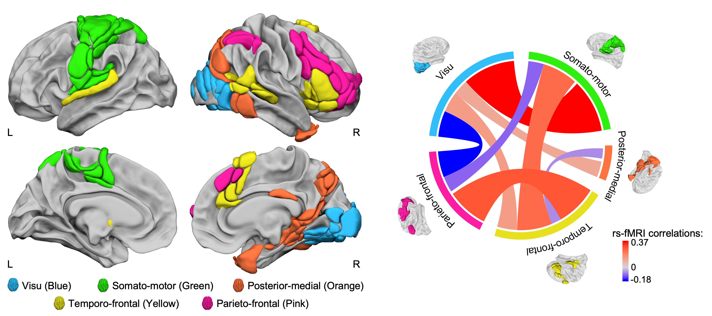

Atlas of Lateralized visuospatial Attentional Networks (ALANs)
================

## Reference

In alignment with the
[SENSAAS](https://github.com/loiclabache/SENSAAS_brainAtlas),
[WMCA](https://github.com/loiclabache/WMCA_brainAtlas) and
[HAMOTA](https://github.com/loiclabache/HAMOTA_brainAtlas) atlases, this
repository features **ALANs**, an atlas comprising 95 specifically
selected regions supporting the **anatomo-functional basis of
visuo-spatial attention** in human.

For usage of the ***manuscript***, please cite:

- **Labache, L.**, Petit, L., Joliot, & Zago, L. (2022). Atlas for the
  Lateralized Visuospatial Attention Networks: Insights from fMRI and
  Network Analyses. DOI: […](...)

For usage of the associated ***code***, please also cite:

- **Labache, L.**, Petit, L., Joliot, & Zago, L. (2022). Atlas for the
  Lateralized Visuospatial Attention Networks: Insights from fMRI and
  Network Analyses. DOI: […](https://zenodo.org/doi/...)

------------------------------------------------------------------------

## Background

Hemispheric specialization is central to human evolution and fundamental
to human cognitive abilities. While being a defining feature of
functional brain architecture, hemispheric specialization is overlooked
to derive brain parcellations. Alongside language, which is typically
lateralized in the left hemisphere, visuospatial attention is set to be
its counterpart in the opposite hemisphere. However, the extent to which
visuospatial attention is a homotop to language remains unclear.
*Building on our previous work*, which established a lateralized brain
atlas for language, we propose a comprehensive **cerebral atlas
delineating the anatomofunctional bases of visuospatial attention**.
Combining task and resting-state functional connectivity analyses, we
identified **95 lateralized brain areas** comprising **five networks**
supporting visuospatial attention processes. Among them, we can find two
large-scale networks: the ParietoFrontal and TemporoFrontal networks.
The rightward lateralized ParietoFrontal network, controlling and
orienting goal-directed attentional processes, encompasses two hubs: the
Inferior Frontal Gyrus (Pars Triangularis) and the posterior part of the
superior temporal sulcus. These hubs play a pivotal role in the
intra-hemispheric interaction within visuospatial attentional networks.
Together, these networks encompass the **homotop of the language
network** from the left hemisphere. This atlas of visuospatial attention
provides valuable insights for future investigations into the
variability of visuospatial attention and hemispheric specialization
research. Additionally, it facilitates more **effective comparisons
among different studies**, thereby enhancing the **robustness** and
**reliability** of research in the field of attention.

------------------------------------------------------------------------

## Code release

The `Script` folder includes 2 `R` scripts alongside.

The `R` scripts are designed to facilitate the replication of results as
detailed in the `Method Section` of the **manuscript**.

- `1_ROI_selection.R`: `R` script to select brain regions that are both
  significantly activated in the right hemisphere and rightward
  lateralized, and regions that are both significantly activated in the
  left hemisphere and leftward lateralized.
- `2_rest_classification_and_metrics.R`: `R` script to perform
  Agglomerative Hierarchical Classification on the average intrinsic
  connectivity matrix, to select the appropriate number of clusters, and
  to compute, for each participant and region, the Degree and the
  Betweenness Centrality.

------------------------------------------------------------------------

## Data release

The `Atlas` folder contains 4 files:

- `read_me_ALANs.rtf`: README file containing information. about the
  atlas
- `ALANs_MNI_ICBM_152_2mm.nii.gz`: NIfTI file containing the 95 brain
  regions in the MNI space.

- `ALANs_description.txt`: text file containing a full description of
  each regions. The first column *Network* corresponds to which of the 5
  networks a region belongs. The second column *Abbreviation* is the
  abbreviation of a region. The third column *Region* is the full
  anatomical label of a region. *Hemisphere* refers to the cerebral
  hemisphere to which a region belongs. *Index* is the index of each
  region that is used in the NIfTI file. Finaly, the MNI coordinate
  (columns *Xmm*, *Ymm*, *Zmm*) of each regions centroid is provided.

- `template_ANTs_80tvs_on_MNI.nii.gz`: brain template used to align the
  atlas on, provided in MNI stereotaxic space (MNI ICBM 152, Template
  sampling size of 2x2x2 mm3 voxels; bounding box, x = -90 to 90 mm, y =
  -126 to 91 mm, z = -72 to 109 mm).

The `Data` folder contains 2 files:

- `130_participants_BOLD_LBJ_BILGIN.txt`: brain activation of each
  participant for each region of the AICHA atlas during the LBJ (Line
  Bisection Judgment) task.

- `130_participants_BOLD_rs_BILGIN.Rds`: resting-state connectivity
  matrices of the 95 ALANs regions for each participant.

------------------------------------------------------------------------

## Other papers and atlases that might interest you

- The seminal paper describing the Line Bisection Judgment task: Zago,
  L., et al. 2017. DOI:
  [10.1016/j.neuropsychologia.2016.11.024](https://doi.org/10.1016/j.neuropsychologia.2016.11.024)
- SEntence Supramodal Areas AtlaS:
  [SENSAAS](https://github.com/loiclabache/SENSAAS_brainAtlas)
- Language-and-Memory atlas:
  [L∪M](https://github.com/loiclabache/RogerLabache_2023_LanguAging/)
- Word-list Multimodal Cortical Atlas:
  [WMCA](https://github.com/loiclabache/WMCA_brainAtlas)
- HAnd MOtor Area atlas:
  [HAMOTA](https://github.com/loiclabache/HAMOTA_brainAtlas)
- Atlas of Intrinsic Connectivity of Homotopic Areas:
  [AICHA](https://www.gin.cnrs.fr/en/tools/aicha/)

------------------------------------------------------------------------

## Questions

Please contact me (Loïc Labache) as <loic.labache@yale.edu> and/or
<loic.labache@ensc.fr>
