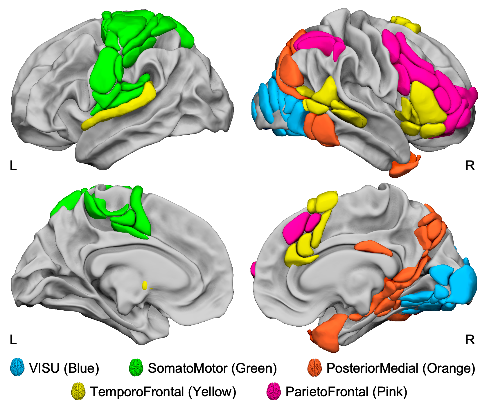

Atlas of Lateralized visuospatial Attentional Networks (ALANs)
================

## Reference

**Labache, L.**, Petit, L., Joliot, & Zago, L. (2022). Atlas for the
Lateralized Visuospatial Attention Networks: Insights from fMRI and
Network Analyses.

------------------------------------------------------------------------

## Background

In the line of the
[SENSAAS](https://github.com/loiclabache/SENSAAS_brainAtlas),
[WMCA](https://github.com/loiclabache/WMCA_brainAtlas) and
[HAMOTA](https://github.com/loiclabache/HAMOTA_brainAtlas) atlases that
have bee proposed to the community, the 95 regions that have been
selected and described in the present work are available as an atlas of
the **anatomo-functional basis of visuo-spatial attention**.

------------------------------------------------------------------------

## Data release

The `Atlas` folder contains 4 files:

- `read_me_ALANs.rtf`: README file containing information about the
  atlas
- `ALANs_MNI_ICBM_152_2mm.nii.gz`: NIfTI file containing the 95 brain
  regions in the MNI space

- `ALANs_description.csv`: CSV file containing a full description of
  each areas. The first column (*Index*) correspond to the index of each
  region that is used in the NIfTI file. The second column (*ROI*) is
  the anatomical labels of each regions. The column *Network*
  corresponded to which of the 5 networks a region belongs. Finaly, the
  MNI coordinate (columns *Xmm*, *Ymm*, *Zmm*) of each regions centroid
  is provided.

- `template_ANTs_80tvs_on_MNI.nii.gz`: brain template used to align the
  atlas on, provided in MNI stereotaxic space (MNI ICBM 152, Template
  sampling size of 2x2x2 mm3 voxels; bounding box, x = -90 to 90 mm, y =
  -126 to 91 mm, z = -72 to 109 mm)

------------------------------------------------------------------------

## Other atlases that might interest you

- SEntence Supramodal Areas AtlaS:
  [SENSAAS](https://github.com/loiclabache/SENSAAS_brainAtlas)
- Language-and-Memory atlas:
  [L∪M](https://github.com/loiclabache/RogerLabache_2023_LanguAging/)
- Word-list Multimodal Cortical Atlas:
  [WMCA](https://github.com/loiclabache/WMCA_brainAtlas)
- HAnd MOtor Area atlas:
  [HAMOTA](https://github.com/loiclabache/HAMOTA_brainAtlas)
- Atlas of Intrinsic Connectivity of Homotopic Areas:
  [AICHA](https://www.gin.cnrs.fr/en/tools/aicha/)

------------------------------------------------------------------------

## Questions

Please contact me (Loïc Labache) as <loic.labache@yale.edu> and/or
<loic.labache@ensc.fr>
